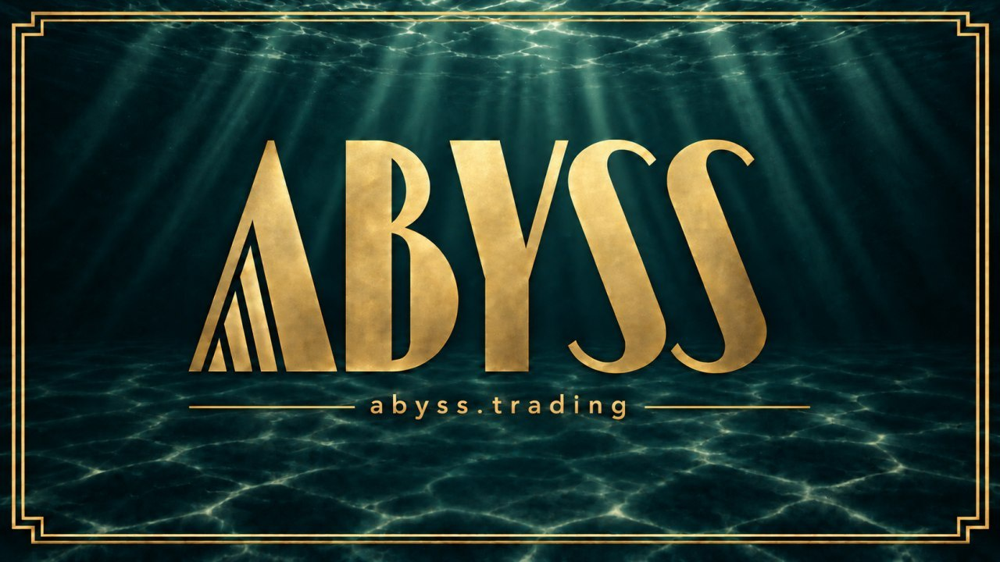

# Abyss Hooks

Contribute pool-bound Uniswap V4 fee hooks to Black Market.

## Submit a hook

1. Copy [`hooks/reference-bound`](hooks/reference-bound) into `hooks/<your-hook>`.
2. Implement your fee formula and complete `hook.json`, `integration.json`, and `review.md`.
3. Run the checks below and open a pull request.

See [CONTRIBUTING.md](CONTRIBUTING.md) for hook requirements and developer royalty terms.

## Run the checks

Requires Python 3.12 and the [pinned Foundry release](CONTRIBUTING.md#local-checks).

```sh
python -m pip install -r scripts/requirements.txt
scripts/install-deps.sh
python scripts/check_hooks.py --output evidence/qualification
```

CI launches a standard ERC20 with a WETH pool, trades both ways, and checks fee collection and royalty payouts against the expected amounts.

Maintainers review each submission. Production registry admission requires separate approval.
